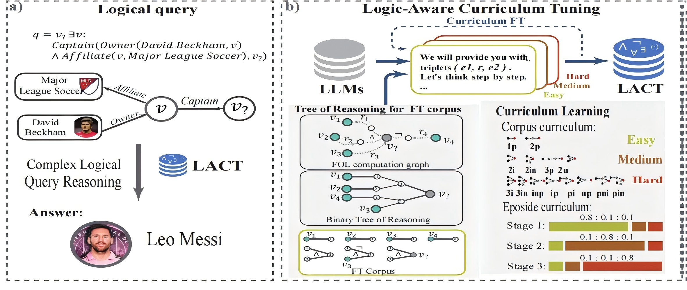

# LACT: Improving Complex Reasoning over Knowledge Graph with Logic-Aware Curriculum Tuning

[![arXiv]🔥] (https://arxiv.org/abs/2405.01649)&nbsp;

  <a href="https://arxiv.org/abs/2405.01649">LACT: Improving Complex Reasoning over Knowledge Graph with Logic-Aware Curriculum Tuning</a>

  

    <strong>AAAI 2025</strong>
  

 

## Installation

1. Prepre python >=3.10
2. Install other pip packages via `pip3 install -r requirements.txt`.
